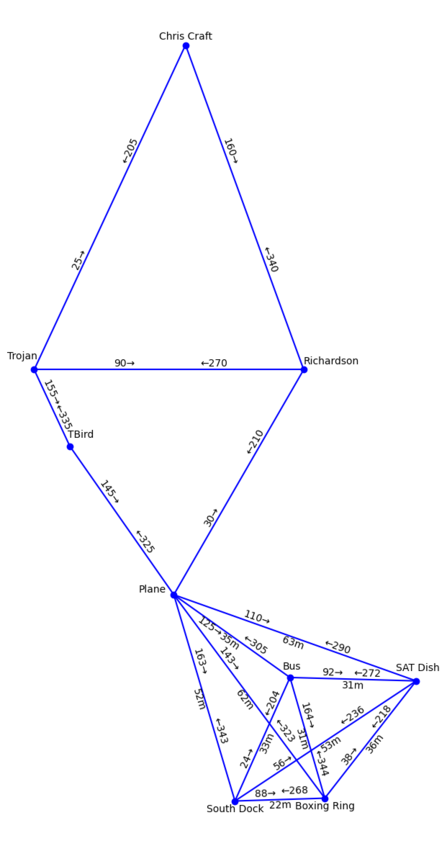

# RelativeMap

Create a map from (relative) node constraints by solving a second-order cone program.

Supported constraints:

- **Directions**: angle relative to north to reach one node from another.
  - Implemented as part of the objective function: can cope with inconsistent constraints.
- **Minimum distance**: minimum distance between two nodes.
  - Implemented as linear constraints. Supported only if the direction between the two nodes is known.
- **Maximum distance**: maximum distance between two nodes.
  - Implemented as linear constraints, if the directions between the two nodes is known. Otherwise, implemented as cone constraints.
- **Locations**: exact location of a node.
  - Implemented by sub-stituting variables (assumed to be perfect).

Depending on the constraints, multiple locations are feassable. To know which information is likely trustworthy, `RelativeMap.stableish_edges` contains edges (node pairs) that are likely stable. If you are at one node, you can likely trust the inferred angle and distance to reach the other node.

## Installation

```sh
# without plotting the map
python -m pip install git+https://github.com/twoertwein/RelativeMap.git
# with plotting the map (installs matplotlib)
python -m pip install 'git+https://github.com/twoertwein/RelativeMap.git#relmap[plot]'
```
## Example

Simple example
```py
from relmap import RelativeMap

r"""
               C (?, ?)
              / \ 
angle: 30    /   \ angle: 330
distance: ? /     \ distance: ?
           /       \ 
   (?, ?) A---------B (?, ?)
         angle: 90 (west)
         distance: 2
"""

RelativeMap(
    {
        ("A", "B"): {"angle": 90, "min_distance": 2, "max_distance": 2},
        ("A", "C"): {"angle": 30},
        ("B", "C"): {"angle": 330},
    },
    angle_unit="degree+clockwise",
).plot()
```


More complex example (locations of a [scuba diving quarray](https://sites.google.com/view/crustys-quarry/home))
```py
from relmap import RelativeMap

min_factor = 0.9
max_factor = 1.1

RelativeMap(
    {
        ("South Dock", "Boxing Ring"): {
            "angle": 90,
            "min_distance": 26 * min_factor,
            "max_distance": 26 * max_factor,
        },
        ("South Dock", "Bus"): {
            "angle": 25,
            "min_distance": 39 * min_factor,
            "max_distance": 39 * max_factor,
        },
        ("Bus", "Boxing Ring"): {"angle": 165},
        ("SAT Dish", "Boxing Ring"): {
            "angle": 220,
            "min_distance": 35 * min_factor,
            "max_distance": 35 * max_factor,
        },
        ("SAT Dish", "Bus"): {
            "angle": 270,
            "min_distance": 27 * min_factor,
            "max_distance": 27 * max_factor,
        },
        ("Bus", "Plane"): {
            "angle": 310,
            "min_distance": 30 * min_factor,
            "max_distance": 30 * max_factor,
        },
        ("Plane", "TBird"): {"angle": 325},
        ("TBird", "Trojan"): {"angle": 335},
        ("Plane", "Richardson"): {"angle": 30},
        ("Trojan", "Richardson"): {
            "angle": 90,
            "min_distance": 70 * min_factor,
            "max_distance": 70 * max_factor,
        },
        ("Trojan", "Chris Craft"): {
            "angle": 25,
            "min_distance": 88 * min_factor,
            "max_distance": 88 * max_factor,
        },
        ("Richardson", "Chris Craft"): {
            "angle": 340,
            "min_distance": 85 * min_factor,
            "max_distance": 85 * max_factor,
        },
        ("Plane", "Trojan"): {"max_distance": 79 * max_factor},
    },
    angle_unit="degree+clockwise",
    # the plot contains all edges that have direction constraints and those
    # that are likely stable enough (in this case stable ~ less then 1m of movement).
    # Only edges that are likely stable have a distance mentioned in the plot
    stable_distance=1.0,
).plot()
```


